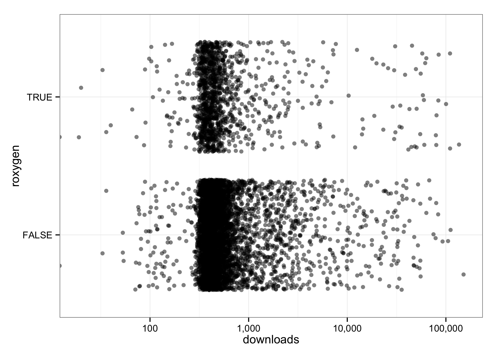
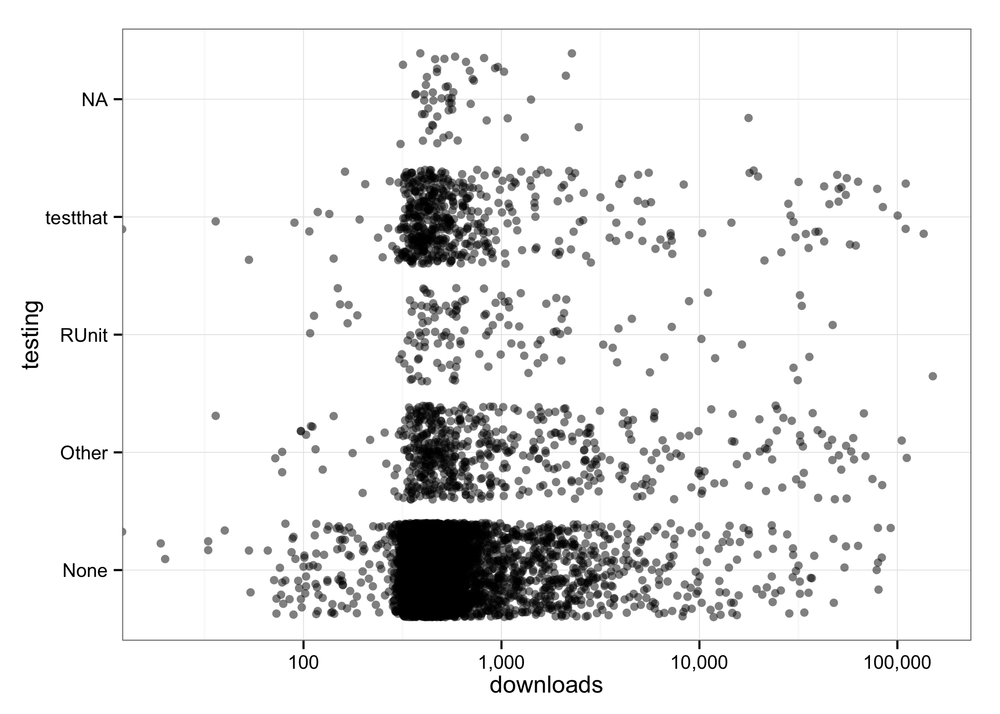

# Jenny Test Drive
Jenny Bryan  
`r Sys.Date()`  


### Temporary workaround: date info

Until `CRANpractices` gets rebuilt with more info about a package's birthdate, most recent update, and number of releases ... I'm gonna grab what I can from `CRANmetadata`.


```
## Warning in left_join_impl(x, y, by$x, by$y): joining factor and character
## vector, coercing into character vector
```

### Frequency tables and barcharts

Many variables take on a small number of values and we can digest their frequencies *en masse*.

There are 6551 packages in this dataset.


 

Variables in `CRANpractices` that are not covered above:


```
##  [1] "package"          "license"          "links_to"        
##  [4] "vignette_format"  "vignette_builder" "downloads"       
##  [7] "links_from"       "first_date"       "pub_date"        
## [10] "nrel"
```

### License

 

### Downloads


```
## Warning in loop_apply(n, do.ply): Removed 2 rows containing non-finite
## values (stat_density).
```

 

```
## Warning in loop_apply(n, do.ply): Removed 1 rows containing non-finite
## values (stat_density).
```

```
## Warning in loop_apply(n, do.ply): Removed 1 rows containing non-finite
## values (stat_density).
```

 

```
## Warning in loop_apply(n, do.ply): Removed 1 rows containing non-finite
## values (stat_density).
```

```
## Warning in loop_apply(n, do.ply): Removed 1 rows containing non-finite
## values (stat_density).
```

 

```
## Warning in loop_apply(n, do.ply): Removed 1 rows containing non-finite
## values (stat_density).
```

```
## Warning in loop_apply(n, do.ply): Removed 1 rows containing non-finite
## values (stat_density).
```

 

   


```
## Source: local data frame [5 x 3]
## 
##   upstream_repo no_dld yes_dld
## 1     BitBucket      0      23
## 2         Email      0      13
## 3        GitHub      1     825
## 4    None/Other      1    5431
## 5       R-Forge      0     257
```

I find it hard to believe that organic human-driven downloads would hit essentially every single package on CRAN within a month. Are there automated systems that, e.g., download CRAN in its entirety as a matter of policy? 

### Vignettes

 

### Number of releases

 

### Date of first and most recent CRAN version


### Practices by date of first recent CRAN version

Left: various approaches to testing against date of most recent version.

Right: Frequency of testing for packages that provide an upstream repo (almost all are GitHub) vs those that do not. A proportional bar chart would be nice ... but don't have yet. Having such a repo appears to be strongly correlated with having tests.

  

### Variables I haven't looked at yet

links_to, links_from
