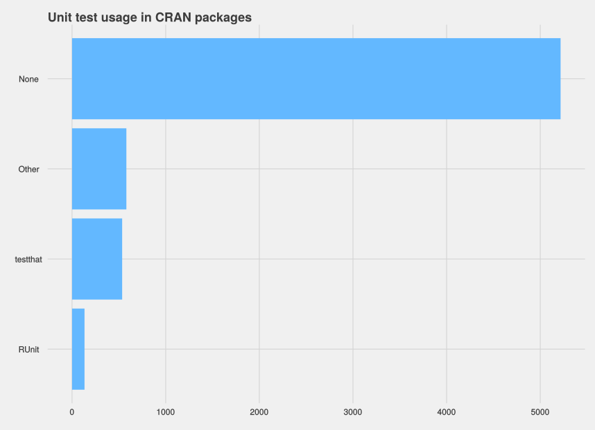

Software Engineering Standards in R Packages
========================================================
author: Oliver Keyes & Jennifer Bryan
date: 2015-07-02

What do we mean by "software engineering standards"?
========================================================

A set of processes and best practices for ensuring that code is "friendly".

* Friendly to the developer: understandable in 6 months, automatically checks for brainweasel issues.
* Friendly to the user: clear documentation, breaks in an understandable fashion, transparently built.

Examples
========================================================

* Unit tests
* Open repositories
* Long-form documentation
* Update news
* Semantic versioning
* Internal comments

What about R? Let's find out!
========================================================

* Get all package DESCRIPTIONs on CRAN (6,551) and their source code
* Parse to identify tests, documentation, releases, categorise metadata.
* Hand-code to make sure that the heuristics works
* Not done yet, but we have done a lot around unit tests

Unit tests in R
========================================================

* Approaches: testthat, RUnit, non-frameworked tests
* As backup, examples

Heuristics:

* Get source code for the most recent package version
* Is there a /tests/testthat folder, or a call to testthat? If so, testthat. Otherwise...
* Is there an RUnit folder/file, or a call to RUnit? If so, RUnit Otherwise..
* Is there a /tests/ folder? "Other". Otherwise..
* "None"

Results
========================================================

How does that change over time?
========================================================

Testing the methodology
========================================================

* Took 50 packages identified as "None" and coded them by hand
* 4 had non-frameworked unit tests, all working in a different way
* A disturbingly large number lacked runnable examples
